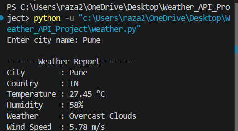

# 🌦️ Weather API Integration

A Python-based Weather API Integration project that fetches real-time weather information for any city using the **OpenWeatherMap API**. This project demonstrates REST API integration, JSON parsing, environment variables, exception handling, and user interaction.

---

## 📌 Features

- ✅ Fetches real-time weather data
- ✅ Search weather by city name
- ✅ Displays temperature in Celsius
- ✅ Shows humidity level
- ✅ Displays weather condition
- ✅ Shows wind speed
- ✅ Uses a secure API key with `.env`
- ✅ Handles invalid city names
- ✅ Handles internet connection errors

---

## 🛠️ Technologies Used

- Python 3
- Requests Library
- Python-dotenv
- REST API
- JSON

---

## ▶️ How to Run

### 1. Clone the repository

```bash
git clone https://github.com/raza242k5-sys/Weather_API_Project.git
```

### 2. Open the project folder

```bash
cd Weather_API_Project
```

### 3. Install the required packages

```bash
pip install -r requirements.txt
```

### 4. Create a `.env` file

Create a file named **`.env`** in the project folder and add your OpenWeatherMap API key.

```env
API_KEY=your_api_key_here
```

> **Note:** The `.env` file is ignored by Git using `.gitignore` to keep your API key secure.

### 5. Run the project

```bash
python weather.py
```

---

## 📷 Sample Output


### 🌦️ Weather Report



---

## 📂 Project Structure

```
Weather_API_Project/
│
├── screenshots/
│   ├── city_input.png
│   └── weather_report.png
│
├── .gitignore
├── README.md
├── requirements.txt
└── weather.py
```

---

## 📚 Concepts Used

- Python Programming
- REST API Integration
- HTTP Requests
- JSON Parsing
- Environment Variables (.env)
- Functions
- User Input
- Exception Handling
- Conditional Statements

---

## 🎯 Learning Outcome

This project helped me understand:

- How REST APIs work
- API authentication using API Keys
- Securing API keys with `.env`
- Sending HTTP GET requests
- Parsing JSON responses
- Handling exceptions
- Working with external libraries
- Building real-world Python applications

---

## 📦 Requirements

Install the required dependencies using:

```bash
pip install -r requirements.txt
```

**requirements.txt**

```text
requests==2.32.5
python-dotenv==1.2.2
```

---

## 👨‍💻 Author

**Raza Ur Rahman**

- 🎓 Computer Engineering Student
- 🐍 Python Developer

### 🌐 Connect with Me

- GitHub: https://github.com/raza242k5-sys
- LinkedIn: https://linkedin.com/in/razarahman242k5/

---

## ⭐ Support

If you found this project useful, consider giving it a ⭐ on GitHub.